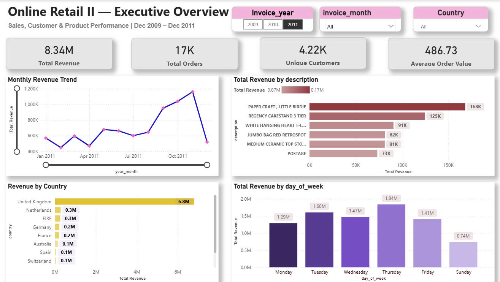

# 🛒 E-Commerce Sales & Customer Intelligence Analysis

> End-to-End Data Analytics Project using Python, SQL, RFM Analysis, and Power BI

## 📌 Project Overview

This project analyzes real-world retail transaction data from the Online Retail II dataset to uncover customer behavior, sales trends, product performance, and revenue opportunities.

The objective is to build a complete Sales & Customer Intelligence Platform that helps business stakeholders understand:

* Revenue trends over time
* Customer purchasing behavior
* High-value customer segments
* Product performance
* Geographic sales distribution
* Customer retention and churn risk

---

## 🎯 Business Problem

A retail company lacked visibility into:

* Customer lifetime value
* Customer churn risk
* Revenue concentration
* Product performance
* Regional sales trends

This project provides actionable insights through data analysis and interactive dashboards.

---

## 🛠️ Tech Stack

### Data Analysis

* Python
* Pandas
* NumPy

### Visualization

* Matplotlib
* Seaborn
* Power BI

### Database

* SQL
* SQLite

### Version Control

* Git
* GitHub

---

## 📂 Project Structure

```text
Online-Retail-Sales-Analysis
│
├── data
│   └── rfm_segments.csv
│
├── notebooks
│   ├── 01_data_cleaning.ipynb
│   ├── 02_eda.ipynb
│   └── 03_rfm_analysis.ipynb
│
├── outputs
│   ├── dashboard.png
│   ├── 01_monthly_revenue_trend.png
│   ├── 02_revenue_by_country.png
│   ├── 03_sales_heatmap.png
│   ├── 04_top_products.png
│   ├── 05_order_value_distribution.png
│   ├── 06_correlation_matrix.png
│   ├── 07_rfm_segmentation.png
│   └── 08_cohort_retention.png
│
├── powerbi
│   └── DA_Project.pbix
│
├── sql
│   ├── 01_create_schema.sql
│   ├── 02_import_data.py
│   ├── 03_kpi_queries.sql
│   └── 04_advanced_queries.sql
│
└── README.md
```

---

## 📊 Key Analysis Performed

### Data Cleaning

* Removed missing customer records
* Removed cancellations and returns
* Handled duplicates
* Feature engineering
* Revenue calculations

### Exploratory Data Analysis

* Revenue trend analysis
* Country-wise revenue analysis
* Product performance analysis
* Customer purchasing patterns
* Order value distribution
* Correlation analysis

### Customer Segmentation

RFM Analysis:

* Champions
* Loyal Customers
* Potential Loyalists
* New Customers
* At Risk Customers
* Lost Customers

### SQL Analytics

* Revenue KPIs
* Customer KPIs
* Product KPIs
* Cohort Analysis
* RFM Analysis
* Advanced Business Queries

---

## 📈 Dashboard Features

### Executive Dashboard

KPIs:

* Total Revenue
* Total Orders
* Unique Customers
* Average Order Value

Visualizations:

* Monthly Revenue Trend
* Revenue by Country
* Top Products by Revenue
* Sales Heatmap
* Customer Segmentation Analysis

Interactive Filters:

* Year
* Month
* Country

---

## 🔍 Key Insights

* Revenue trends show strong seasonal patterns.
* A small percentage of customers contribute a large share of total revenue.
* Several customer segments require retention strategies.
* Product sales are concentrated among a limited number of top-performing products.
* International markets provide significant revenue opportunities.

---

## 📸 Dashboard Preview

### Executive Dashboard



---

## 📁 Dataset

Dataset Used:

**Online Retail II Dataset (UCI Machine Learning Repository)**

Contains:

* 1M+ retail transactions
* Customer information
* Product information
* Revenue data
* Geographic data

---

## 🚀 Skills Demonstrated

* Data Cleaning
* Data Analysis
* Feature Engineering
* SQL Querying
* RFM Segmentation
* Cohort Analysis
* Data Visualization
* Dashboard Development
* Business Intelligence
* Power BI
* Python Programming

---

## 👩‍💻 Author

**Kusmanjali M**

Data Analyst | Python Developer

Skills:

* Python
* SQL
* Power BI
* Excel
* Pandas
* NumPy
* Matplotlib
* Seaborn
* Django

---

⭐ If you found this project useful, feel free to star the repository.
